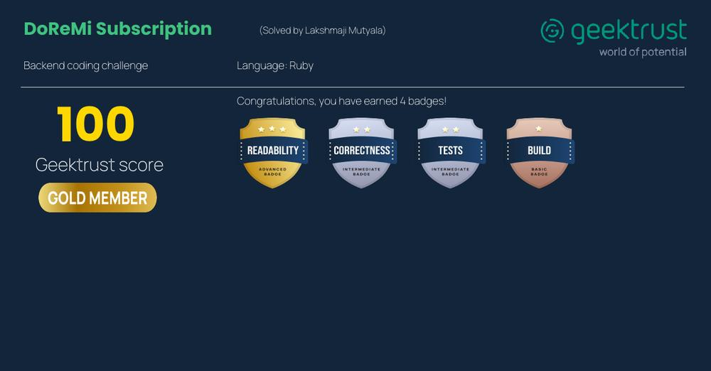

# Netflix kind of subscription tool

[](https://github.com/lakshmaji/netflix-subscription-cli/actions/workflows/build.yml) [](https://github.com/lakshmaji/netflix-subscription-cli/actions/workflows/test.yml) [](https://github.com/lakshmaji/netflix-subscription-cli/actions/workflows/lint.yml) [](https://github.com/rubocop/rubocop) [](https://rubystyle.guide)

This is a sample CLI application, which tries to illustrate the concepts of subscription based on a particular category and devise limits. This is written in Ruby programming following principles of the Test Driven Development (TDD) approach.

## Pre-requisites

* Ruby 3.1.2
* Bundler 2.2.22



## Development

### Installation

```bash
bundle install
```

### How to run the code

#### Using rake

```bash
rake default sample_input/input1.txt
```

#### Using shell scripts

Use `run.sh` if you are Linux/Unix/macOS Operating systems and `run.bat` if you are on Windows.  Both the files run the commands silently and prints only output from the input file `sample_input/input1.txt`.

Internally both the scripts run the following commands, 
 
 1. `bundle install` - We will install the dependencies and then build the solution by using the following command.
 2. We will execute the program using the command `rake default sample_input/input1.txt`

The program will take the location to the text file as parameter. Input needs to be read from a text file, and output will be printed to the console.

### Unit tests

 Uses `RSpec` library for unit testing and `simple-cov` to calculate the unit test coverage.

We run the unit tests and calculate the coverage executing the command

```bash
rspec
```
